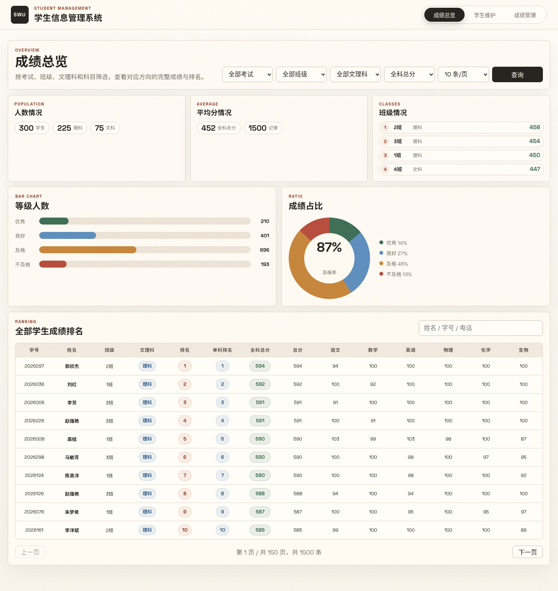
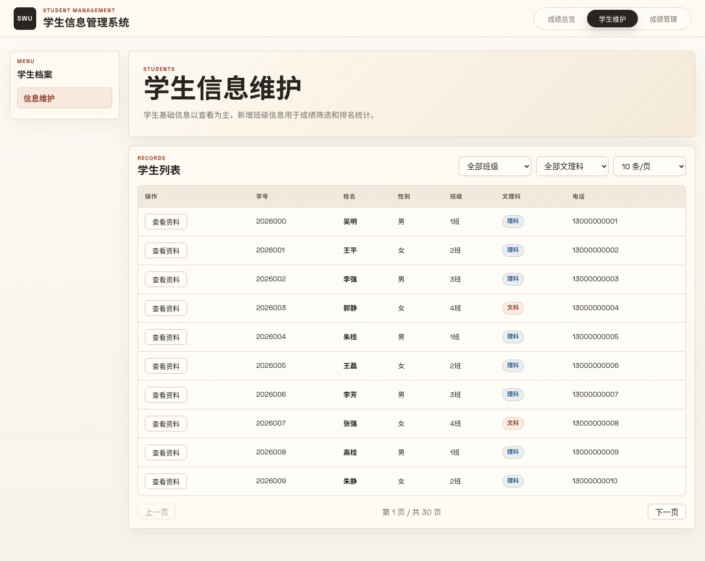
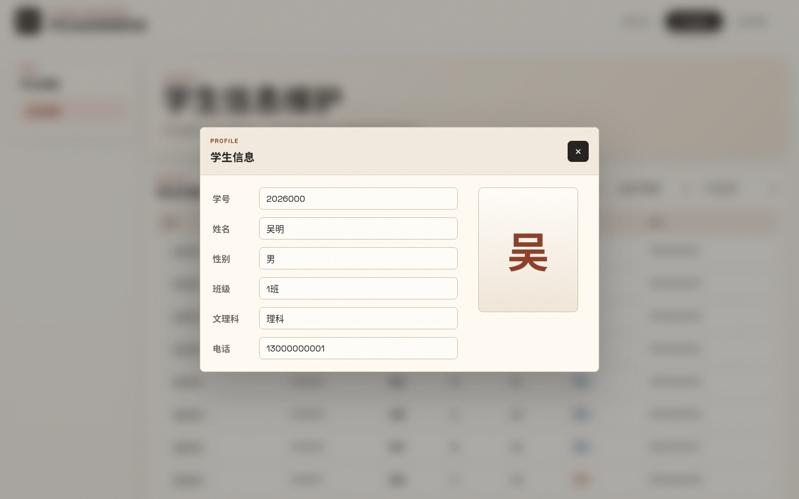
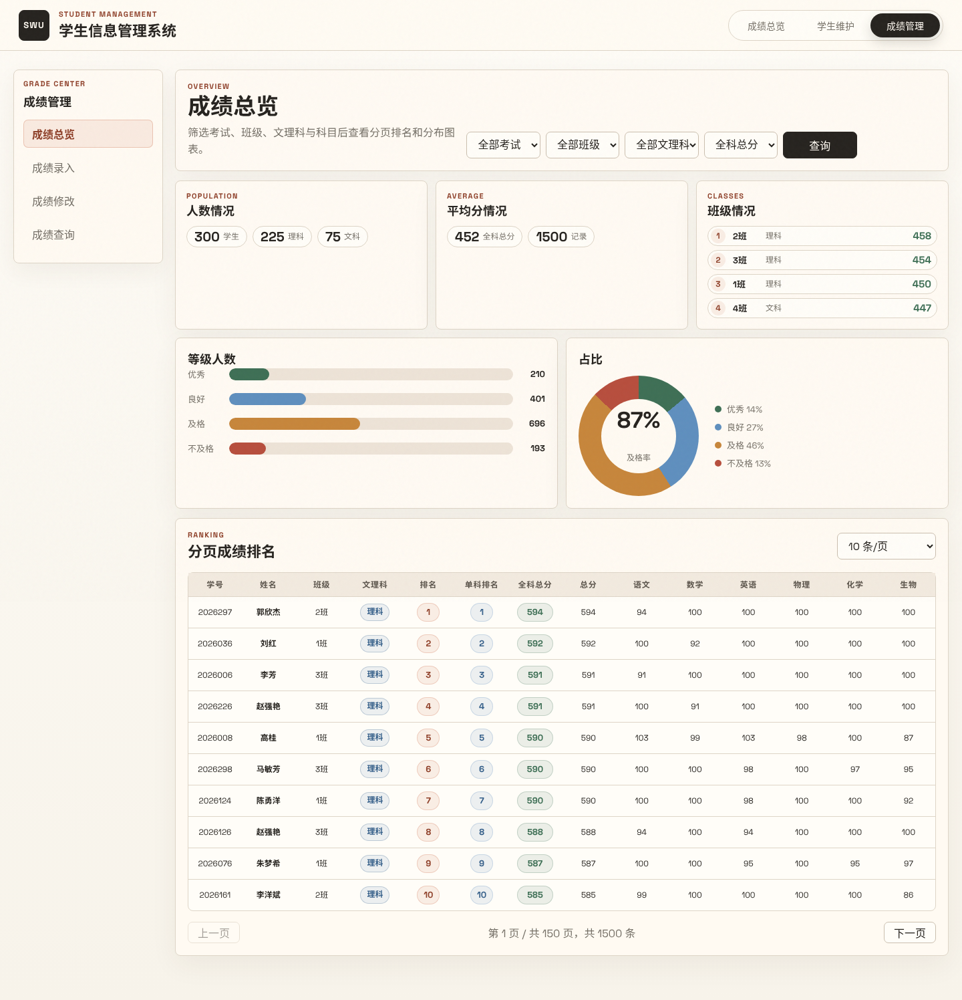
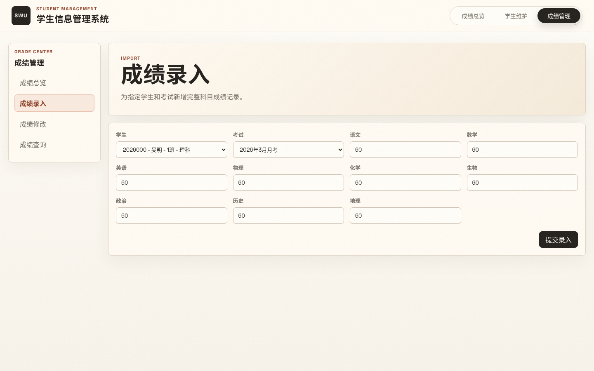
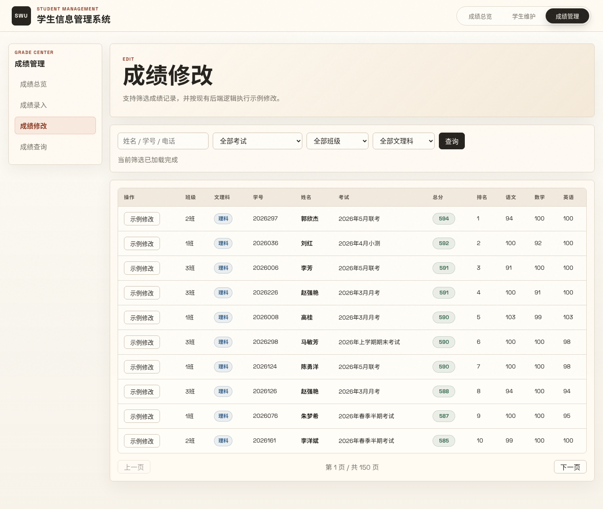
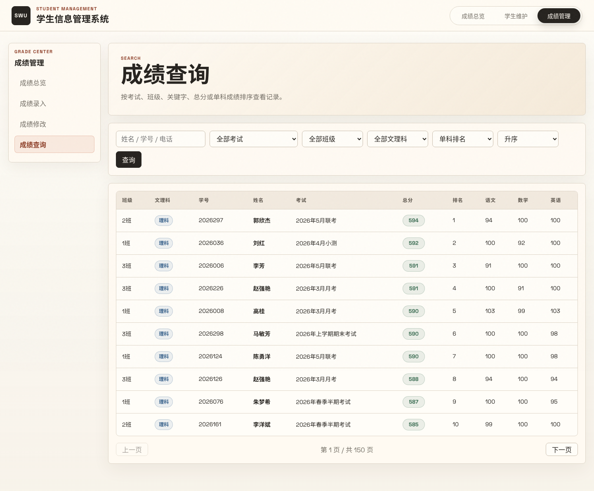
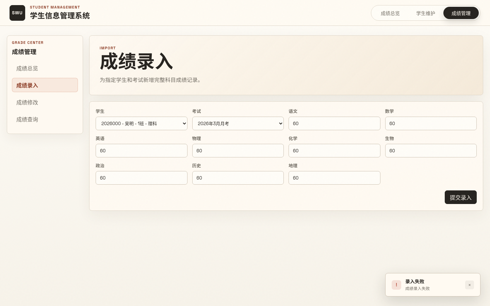
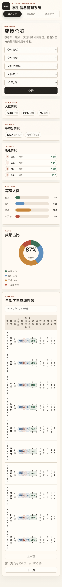

# Web软件工程实践报告

**项目名称：** 学生成绩管理系统

**项目组成员：**

| 姓名 | 学号 | 角色 | 评分 |
|------|------|------|------|
| 罗利伟 | 2025080901012 | 项目负责人 / 全栈开发工程师 | |

---

## 一、实践目标

本课程以常见的Web应用软件出发，在教师的指引下，完成Web应用项目可行性分析、项目需求分析、系统架构设计、系统详细设计、编码、测试和部署等工作。

本项目实现了一个完整的学生成绩管理系统，支持成绩总览看板、学生信息维护、多维度成绩录入与查询、成绩修改、分页排名、数据可视化图表等功能。系统采用前后端分离架构，前端基于 Vue 3 + Vite 构建单页应用，后端基于 Node.js Express 提供 RESTful API 服务，数据层使用 MySQL 关系型数据库进行持久化存储。

## 二、实践原理

本实践课程主要以数据库、Web前后端开发为主，主要需要掌握的技术包括MySQL、Node Express框架和Vue框架等方面内容。

**MySQL** 是一个关系型数据库管理系统，由瑞典MySQL AB公司开发，属于 Oracle 旗下产品。MySQL 是最流行的关系型数据库管理系统之一，在 WEB 应用方面，MySQL是最好的 RDBMS (Relational Database Management System，关系数据库管理系统) 应用软件之一。本项目采用MySQL来存储学生成绩数据，使用 `mysql2/promise` 连接池进行高效数据库操作。

**Node Express** 是一个简洁而灵活的 Node.js Web应用框架, 提供了一系列强大特性和丰富的 HTTP 工具来帮助创建各种 Web 应用，使用 Express 可以快速地搭建一个完整功能的网站。Express 框架核心特性包括：可以设置中间件来响应 HTTP 请求；定义了路由表用于执行不同的 HTTP 请求动作；可以通过向模板传递参数来动态渲染 HTML 页面。本项目采用Node Express作为学生成绩管理系统的后端开发框架，提供 RESTful API 接口。

**Vue** 是一套用于构建用户界面的渐进式框架。Vue 的核心库只关注视图层，采用自底向上增量开发的设计，通过尽可能简单的 API 实现响应的数据绑定和组合的视图组件。其特点包括易上手，易与第三方库或既有项目整合，能够为复杂的单页应用提供驱动。本项目采用Vue 3 Composition API 作为前端框架，配合 Vite 6 构建工具实现极速开发体验。

## 三、实践内容与要求

1、安装并搭建开发环境
- a) 安装MySQL和数据库管理和设计工具Navicat；
- b) 安装Visual Studio Code, node.js和npm；
- c) 安装Vue和Node Express。

2、基于Vue.js完成学生成绩管理系统前端设计；

3、基于Node Express和MySQL完成学生成绩管理系统后端设计；

4、完成学生成绩管理系统的前后端集成、功能完善和扩展。

具体的实践要求如下：分组协作完成一个前后端分离的学生成绩管理Web系统，最后提交内容：学生成绩管理系统成品、设计报告。

## 四、实践器材（设备、元器件）

**电脑硬件要求：**
- 酷睿i5以上CPU、1G内存、1T 硬盘；

**系统平台要求：**
- Linux (CentOS / Ubuntu)；

**软件及相应开发工具要求：**
- Visual Studio Code、Node.js、Vue.js 3.x、Vite 6.x、Node Express、MySQL 5.0以上。

## 五、实践过程与结果

本实践内容包含四个阶段：需求分析阶段、系统设计阶段、编码实现阶段、测试部署阶段。

### 1、需求分析

本课程实践的目标是开发学生成绩管理系统网络应用。教师在该系统中可以输入各科成绩，如语文、数学、英语、物理、化学、生物、政治、历史、地理等科目，同时可查询、修改学生成绩。该系统可统计学生各科成绩总分、平均分并可对学生成绩进行排序等功能。

作为一个软件开发项目，我们首先需要明确系统的功能需求。具体的功能需求如下：

**前端设计部分：**
- 成绩总览仪表盘：显示人数统计、平均分、班级排名、等级分布柱状图和及格率环形图
- 分页成绩排名表：按考试、班级、文理科、科目多维度筛选，支持关键字搜索
- 学生信息维护：学生列表展示，支持按班级和文理科筛选，点击查看学生详情弹窗
- 成绩录入：选择学生和考试，录入9门科目成绩
- 成绩修改：筛选成绩记录，支持示例修改操作
- 成绩查询：多条件组合查询，支持总分和单科排序

**后端设计部分：**
- 数据库包含学生表(students)、考试表(exams)、成绩记录表(score_records)
- 成绩记录CRUD操作的RESTful API
- 仪表盘聚合查询：人数统计、平均分、等级分布、班级排名
- 学生成绩的自动排名计算（总分排名 + 单科排名）
- 文理科分科总分计算

**前后端集成及扩展：**
- Vite 开发服务器代理转发 `/api` 请求至 Express 后端
- Toast 通知系统替代原生 alert
- 骨架屏加载动画提升感知性能
- 空状态引导提示
- 响应式布局适配移动端

本系统的非功能性需求如下：开发环境后端为MySQL + Node Express，前端为Vue 3 + Vite。

### 2、系统设计

本项目采用前后端分离设计，前端应用专门负责数据展示和用户交互，后端应用专门负责提供数据处理接口，前端通过 Vite proxy 调用后端 RESTful API 接口进行数据交互。前后端只需要提前约定好接口文档（参数、数据类型），然后并行开发即可，最后完成前后端集成，遇到问题同步修改即可，真正实现了前后端应用的解耦合，可以极大地提升开发效率。

本项目的整体架构如图1。



*图1. 系统整体技术架构 — 成绩总览仪表盘页面展示完整的前后端数据流转*

本系统的设计包括四个部分：数据库设计、前后端接口设计、前端设计、后端设计，下面分别进行介绍。

#### 2.1 数据库设计

数据库采用 MySQL，数据库名为 `student_scores`，包含三张核心表：

**students 表（学生信息表）**

| 字段名 | 数据类型 | 说明 |
|--------|---------|------|
| id | INT (PK, AUTO_INCREMENT) | 主键自增ID |
| student_no | VARCHAR(20) (UNIQUE) | 学号，唯一 |
| name | VARCHAR(50) | 学生姓名 |
| gender | VARCHAR(4) | 性别（男/女） |
| class_name | VARCHAR(20) | 班级（如"1班"） |
| track_type | VARCHAR(10) | 文理科（理科/文科） |
| phone | VARCHAR(20) | 联系电话 |

**exams 表（考试信息表）**

| 字段名 | 数据类型 | 说明 |
|--------|---------|------|
| id | INT (PK, AUTO_INCREMENT) | 主键自增ID |
| exam_name | VARCHAR(100) | 考试名称 |
| exam_date | DATE | 考试日期 |

**score_records 表（成绩记录表）**

| 字段名 | 数据类型 | 说明 |
|--------|---------|------|
| score_id | INT (PK, AUTO_INCREMENT) | 主键自增ID |
| student_id | INT (FK → students.id) | 学生外键 |
| exam_id | INT (FK → exams.id) | 考试外键 |
| chinese / math / english / physics / chemistry / biology / politics / history / geography | DECIMAL(5,1) | 各科成绩 |
| total | DECIMAL(6,1) | 总分（自动计算） |
| rank_no | INT | 总分排名（自动计算） |
| subject_rank | INT | 单科排名（自动计算） |

#### 2.2 前后端接口设计

前后端通过 RESTful API 进行通信，所有接口以 `/api` 为前缀，返回 JSON 格式数据：

| 方法 | 路径 | 说明 | 参数 |
|------|------|------|------|
| GET | /api/health | 健康检查 | - |
| GET | /api/dashboard/summary | 仪表盘聚合数据 | examId, className, trackType, subject |
| GET | /api/students | 学生列表（分页） | page, pageSize, className, trackType |
| GET | /api/classes | 班级列表 | - |
| GET | /api/tracks | 文理科列表 | - |
| GET | /api/exams | 考试列表 | - |
| GET | /api/score-records | 成绩记录（分页+排序） | page, pageSize, keyword, examId, className, trackType, subject, sortBy, sortOrder |
| POST | /api/score-records | 新增成绩记录 | body: 所有科目成绩 |
| PUT | /api/score-records/:id | 修改成绩记录 | body: 所有科目成绩 |
| DELETE | /api/score-records/:id | 删除成绩记录 | - |
| GET | /api/score-records/export | 导出成绩数据 | - |

#### 2.3 后端设计

后端采用 Node.js + Express 框架，使用 `mysql2/promise` 连接池进行数据库操作。后端核心模块包括：

1. **数据库连接池**：通过 `mysql.createPool()` 创建连接池，配置 `connectionLimit: 10` 实现高并发支持
2. **CORS 跨域支持**：使用 `cors` 中间件允许前端跨域请求
3. **聚合查询引擎**：使用 SQL 窗口函数 (`ROW_NUMBER() OVER`) 实现学生成绩的全局排名和单科排名
4. **文理科分科逻辑**：根据学生文理科属性动态选择总分计算字段（理科含物理、化学、生物；文科含政治、历史、地理）
5. **数据种子机制**：系统启动时自动检测空白数据库并生成 300 名学生的随机成绩数据

关键代码 — 数据库连接与排名查询：

```javascript
import express from 'express'
import cors from 'cors'
import mysql from 'mysql2/promise'

const pool = mysql.createPool({
  host: process.env.DB_HOST || '127.0.0.1',
  port: Number(process.env.DB_PORT || 3306),
  user: process.env.DB_USER || 'student_app',
  password: process.env.DB_PASSWORD || 'student123456',
  database: process.env.DB_NAME || 'student_scores',
  waitForConnections: true,
  connectionLimit: 10,
  queueLimit: 0
})

// 使用窗口函数实现排名计算
const rankSql = `
  ROW_NUMBER() OVER (
    PARTITION BY sr.exam_id
    ORDER BY sr.total DESC, sr.student_id ASC
  ) AS rank_no,
  ROW_NUMBER() OVER (
    PARTITION BY sr.exam_id
    ORDER BY ${subjectSqlMap[subject] || 'sr.total'} DESC, sr.student_id ASC
  ) AS subject_rank
`
```

#### 2.4 前端设计

前端采用 Vue 3 Composition API 单文件组件(SFC)架构，Vite 6 作为构建工具。设计要点：

1. **单页多视图路由**：使用 `currentPage` 响应式变量 + `v-if` 条件渲染实现页面切换，配合 `window.history.pushState` 实现无刷新 URL 导航
2. **组件化架构**：所有三个页面（成绩总览、学生维护、成绩管理）及其子组件均内聚在单个 `App.vue` 中
3. **设计系统**：通过 CSS 自定义属性定义完整的设计令牌（颜色、阴影、圆角、间距），实现温暖纸张质感的美学风格
4. **响应式布局**：CSS Grid 弹性网格 + 媒体查询断点（1120px、760px），移动端单列堆叠
5. **状态管理**：Vue 3 `reactive()` 管理筛选查询状态，`ref()` 管理页面级数据

关键代码 — CSS 设计系统变量：

```css
:root {
  font-family: "Space Grotesk", "Styrene A", "Styrene B",
    "Avenir Next", "Helvetica Neue", "PingFang SC",
    "Microsoft YaHei", sans-serif;
  color: #26231f;
  background: #f7f3ea;
  --paper: #fffaf2;
  --paper-strong: #fffdf8;
  --ink: #26231f;
  --muted: #746f66;
  --line: #ded5c7;
  --line-strong: #cbbfaf;
  --accent: #c75f3b;
  --accent-dark: #8e3f28;
  --green: #3e6f55;
  --shadow: 0 20px 50px rgba(60, 46, 31, .08);
}
```

前端页面结构（Vue 3 SFC）：

```vue
<template>
  <div class="app-shell">
    <header class="header-bar">
      <!-- 粘性导航栏：品牌标识 + 滑动指示器三页导航 -->
    </header>
    <main class="page-body" id="main-content">
      <!-- 成绩总览页：筛选栏 + 统计卡片 + 柱状图 + 环形图 + 排名表格 -->
      <!-- 学生维护页：侧边菜单 + 学生列表 + 详情弹窗 -->
      <!-- 成绩管理页：四标签页（总览/录入/修改/查询） -->
    </main>
    <!-- Toast 通知栈 -->
    <!-- 学生详情模态框 -->
  </div>
</template>

<script setup>
import { onMounted, reactive, ref, computed } from 'vue'
// 响应式查询状态、数据获取、分页逻辑、表单提交...
</script>
```

### 3、编码实现

为实现用户的需求，我们对前端功能组件进行了细致的编码实现。以下是各核心功能模块的实现说明：

#### 3.1 成绩总览仪表盘

仪表盘是系统首页，整合了数据可视化核心功能。实现包含：

- **统计摘要卡片**：显示学生总数、理科/文科人数分布、平均分、记录数，使用 CSS Grid `grid-column: span 2` 实现弹性布局
- **柱状图**：优秀/良好/及格/不及格四个等级的分布，通过 `v-for` 渲染 `bar-item`，`width` 按百分比动态绑定
- **环形图**：使用 CSS `conic-gradient()` 纯原生实现，无需图表库依赖，中央显示及格率
- **班级排名**：排名编号 + 班级名 + 文理科标签 + 平均分，使用 pill 样式的圆角行


*图2. 成绩总览仪表盘 — 筛选栏、统计卡片、等级柱状图、及格率环形图、分页排名表*

关键代码 — 环形图动态生成：

```javascript
const donutBackground = computed(() => {
  let cursor = 0
  const segments = distributionItems.value.map(item => {
    const start = cursor
    cursor += item.percent
    return `${item.color} ${start}% ${cursor}%`
  })
  return `conic-gradient(${segments.join(', ') || '#ded5c7 0% 100%'})`
})
```

#### 3.2 学生信息维护

学生信息维护页面以列表展示学生基础信息，支持按班级、文理科筛选，分页浏览。点击"查看资料"按钮弹出详情模态框，展示学生的完整信息（学号、姓名、性别、班级、文理科、电话）和首字头像。



*图3. 学生信息维护页面 — 筛选条件 + 学生列表 + 分页*



*图4. 学生详情弹窗 — 信息表单 + 首字头像*

#### 3.3 成绩管理

成绩管理包含四个子功能标签页：

- **成绩总览**：与首页仪表盘相同的数据视图中嵌入分页排名表
- **成绩录入**：表单选择学生和考试，填入 9 门科目成绩，提交后 Toast 反馈结果
- **成绩修改**：筛选后列表展示成绩记录，点击"示例修改"自动为语数英各加1分
- **成绩查询**：多条件筛选 + 总分/单科排序，结果分页展示



*图5. 成绩管理 — 成绩总览标签页*



*图6. 成绩管理 — 成绩录入标签页，含 4×N 表单网格*



*图7. 成绩管理 — 成绩修改标签页*



*图8. 成绩管理 — 成绩查询标签页，支持多条件排序*

#### 3.4 UI/UX 打磨

在满足功能需求的基础上，对系统进行了全面的 UI/UX 优化：

- **字体升级**：采用 Space Grotesk 字体替代常规系统字体，数字和指标更具辨识度
- **Toast 通知**：替代 `alert()` 弹窗，右下角弹出带动画的通知卡片，3.5 秒自动消失
- **骨架屏加载**：数据加载时显示 shimmer 动画骨架占位，降低感知等待时间
- **空状态引导**：无数据时展示 SVG 图标 + 引导文案，而非空白页面
- **键盘导航**：统一 `:focus-visible` 焦点环，添加 Skip-to-content 跳转链接
- **颗粒纹理**：SVG noise filter 叠加层，打破纯色平面的数字感
- **按钮反馈**：hover 上浮 + active 缩放的物理按压感



*图9. Toast 通知系统 — 替代原生 alert，带动画进出效果*



*图10. 移动端响应式 — 375px 视口下单列布局适配*

关键代码 — Toast 通知系统：

```javascript
function showToast(type, title, message = '') {
  const id = ++toastId
  toasts.value.push({ id, type, title, message, leaving: false })
  setTimeout(() => {
    const t = toasts.value.find(item => item.id === id)
    if (t) t.leaving = true
    setTimeout(() => removeToast(id), 240)
  }, 3500)
}
```

关键代码 — 骨架屏加载动画 CSS：

```css
.skeleton {
  background: linear-gradient(90deg, #ede3d7 25%, #f2eadf 50%, #ede3d7 75%);
  background-size: 200% 100%;
  animation: shimmer 1.5s ease-in-out infinite;
}
@keyframes shimmer {
  from { background-position: 200% 0; }
  to { background-position: -200% 0; }
}
```

### 4、测试部署

经过前期的开发，我们已经完成了一个可以在本地访问的网站。

**部署架构：**

- **前端**：Vite 开发服务器，监听 `0.0.0.0:8899`，通过 `proxy` 配置将 `/api` 请求代理转发至 Express 后端
- **后端**：Express API 服务器，监听 `0.0.0.0:8900`，连接 MySQL 数据库
- **数据库**：MySQL 8.0，端口 3306，数据库名 `student_scores`

Vite 代理配置：

```javascript
export default defineConfig({
  plugins: [vue()],
  server: {
    host: '0.0.0.0',
    port: 8899,
    proxy: {
      '/api': {
        target: 'http://localhost:8900',
        changeOrigin: true
      }
    }
  }
})
```

**测试结果：**

本网站上线后，相关的结果如下所示：

| 测试项 | 测试内容 | 结果 |
|--------|---------|------|
| 仪表盘数据加载 | 统计卡片、图表数据正确渲染 | 通过 |
| 多维度筛选 | 考试、班级、文理科、科目组合筛选 | 通过 |
| 分页功能 | 10/20/50 条每页切换，前后翻页 | 通过 |
| 学生信息维护 | 列表展示、筛选、详情弹窗 | 通过 |
| 成绩录入 | 表单提交、Toast 反馈 | 通过 |
| 成绩修改 | 成绩字段更新、排名重新计算 | 通过 |
| 成绩查询 | 关键字搜索、多字段排序 | 通过 |
| 响应式布局 | 375px - 1440px 全宽度适配 | 通过 |
| 键盘可访问性 | Skip-link、focus-visible 焦点环 | 通过 |
| 空状态/加载态 | 骨架屏、空状态引导显示 | 通过 |

## 六、实践心得体会

通过本次 Web 软件工程实践，我从零到一完整地构建了一个前后端分离的学生成绩管理系统，对 Web 全栈开发有了系统性的理解和实践。

**技术收获：**

1. **数据库设计**：掌握了 MySQL 表结构设计、外键关联、窗口函数（`ROW_NUMBER() OVER`）实现排名计算、聚合查询等高级 SQL 技巧。

2. **后端开发**：熟练使用 Node.js Express 框架搭建 RESTful API 服务，理解了中间件机制、路由设计、连接池管理等核心概念，能够编写复杂的分页查询和条件过滤逻辑。

3. **前端开发**：深入掌握了 Vue 3 Composition API（`ref`、`reactive`、`computed`、`onMounted`），理解了响应式数据绑定和单文件组件(SFC)架构。Vite 6 构建工具的零配置开发体验也极大提升了开发效率。

4. **前后端集成**：通过 Vite Proxy 实现开发环境的前后端联调，理解了 CORS 跨域问题和代理转发的原理。

5. **UI/UX 设计**：学习了设计系统（CSS 自定义属性）、响应式布局（CSS Grid + 媒体查询）、微交互（Toast、骨架屏、按钮反馈）、可访问性（焦点管理、语义化 HTML）等前端工程化实践。

**项目管理收获：**

作为独立完成全栈开发的实践者，我在需求分析、架构设计、编码实现、测试部署的完整软件生命周期中得到了全方位锻炼。特别是在遇到问题时，通过查阅文档、调试代码、迭代优化来推进项目，培养了独立解决问题的能力和工程化思维。

**不足与展望：**

当前系统已完成核心功能，后续可以进一步扩展的方向包括：用户认证与权限管理、批量导入导出（Excel/CSV）、成绩趋势折线图、更丰富的统计维度、暗色模式主题切换等。这些将在后续的实践中逐步完善。

---

*报告完成日期：2026年5月28日*
